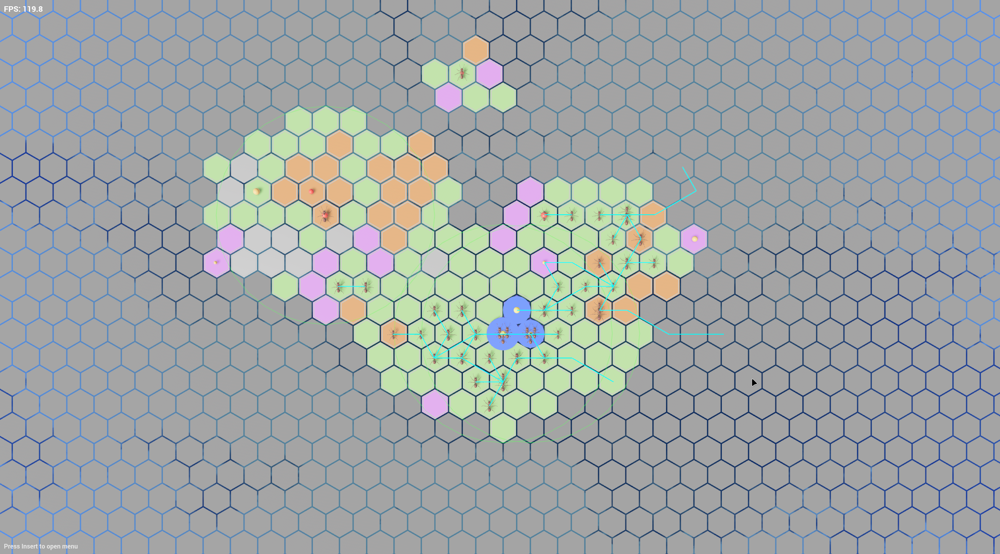

<a name="readme-top"></a>

<details>
  <summary>Table of Contents</summary>

- [About The Project](#about-the-project)
- [Documentation](#documentation)
- [Getting Started](#getting-started)
  - [Requirements](#requirements)
  - [Dependencies](#dependencies)
  - [How to Build](#how-to-build)
- [License](#license)
- [Contact](#contact)
</details>

## About The Project

**DatsPulse** is a solution developed for the Gamathon event.
It leverages modern Rust technologies to provide a robust, async, and interactive application.



---

## Game docs and info

- [HTML page](docs/datspulse_docs.html)

---

## Getting Started

### Requirements

- [Rust](https://www.rust-lang.org/tools/install) (with Cargo)

### Dependencies

This project uses the following main dependencies:

- **[toml](https://crates.io/crates/toml)**: For parsing configuration files.
- **[chrono](https://crates.io/crates/chrono)**: Date and time utilities, with Serde support.
- **[anyhow](https://crates.io/crates/anyhow)** & **[thiserror](https://crates.io/crates/thiserror)**: Error handling and custom error types.
- **[log](https://crates.io/crates/log)**, **[tracing](https://crates.io/crates/tracing)**, **[tracing-subscriber](https://crates.io/crates/tracing-subscriber)**, **[tracing-appender](https://crates.io/crates/tracing-appender)**: Logging and tracing infrastructure.
- **[tokio](https://crates.io/crates/tokio)** & **[futures](https://crates.io/crates/futures)**: Asynchronous runtime and utilities.
- **[reqwest](https://crates.io/crates/reqwest)**: HTTP client with JSON support.
- **[serde](https://crates.io/crates/serde)** & **[serde_json](https://crates.io/crates/serde_json)**: Serialization and deserialization of data structures.
- **[uuid](https://crates.io/crates/uuid)**: Universally unique identifiers (UUIDs), with Serde support.
- **[bevy](https://crates.io/crates/bevy)**: Game engine for rendering and ECS.
- **[bevy-tokio-tasks](https://crates.io/crates/bevy-tokio-tasks)**: Integrates Tokio tasks with Bevy.
- **[bevy_ui](https://crates.io/crates/bevy_ui)**: UI toolkit for Bevy.
- **[bevy_egui](https://crates.io/crates/bevy_egui)**: Egui integration for Bevy, for immediate mode GUIs.

---

### How to Build

1. **Clone the repository**

```sh
git clone https://github.com/RexarX/DatsPulse.git
cd DatsPulse
```

2. **Build the project**

```sh
cargo build --release
```

---

## License

Distributed under the **MIT License**. See [`LICENSE`](LICENSE) for more information.

---

## Contact

- RexarX — [who727cares@gmail.com](mailto:who727cares@gmail.com)
- PlatonFPS — [platonfps@yandex.ru](mailto:platonfps@yandex.ru)

---

[↑ Back to Top](#readme-top)
